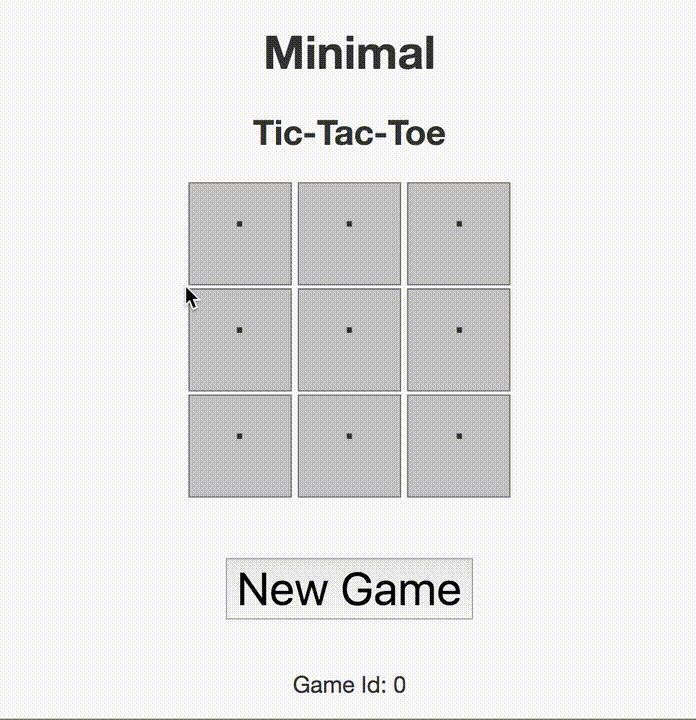

# Minimal Tic-Tac-Toe
A Python-JavaScript hybrid web game



## Overview

This pair of microservices work together to provide a web game and supporting API.

* The ```/api/``` directory contains the Python 3 code for a RESTful API. This interfaces with a very simple SQLite database stored under the ```/db/``` directory. 
* The ```/webapp/``` directory holds another Flask server built with Python 3, but in this case it both serves the web page (HTML, CSS, and JavaScript 6) as well as interfaces with the API using the Requests package.

### API 

The API runs over localhost port 8001 and follows the following scheme:

```localhost:8001/game/<game_id>```

where the ```<game_id>``` is some integer corresponding to a game stored in the database. When a ```GET``` request is given to this address, the API returns JSON in the format

```{"games": [[<game_id>, <game_state>]]}```

where ```<game_state>``` is simply a 9-digit string of `.`, `x`, and `o` characters representing the board layout in **column-major** order. This is simpler and easier to implement than maintaining 9 different fields (one for each cell), but would require extensive error-checking before full deployment.

### Web Server

The server component of the web app runs over localhost port 8002. Previous (finished or unfinished) games can be retrieved using the URL scheme

```localhost:8002/game/<game_id>```

This Flask server renders the HTML template stored in the ```/webapp/templates/``` directory and links it with the corresponding CSS and JS files in the ```/webapp/static/``` directory. 

### JavaScript logic

The basic logic of the game runs in a single JavaScript ES6 file that:

* Does basic validation of moves
* Controls the very-naive AI (random moves in free cells)
* Checks when a player (or the AI) has won and ends the game
* Interfaces with the API using fetch() functions and promises
* Resets the board and creates a new game when the user clicks 'New Game' 

## Installation
First, ensure you have Python 3.6+, pip, and pipenv installed.

Clone the repo and cd into the directory

```bash
git clone https://github.com/gianlucatruda/tic-tac-toe.git
cd tic-tac-toe
```

Start a new virtual environment for the project 

```bash
pipenv shell
```

Then install the dependencies in ```requirements.txt``` to that virtual environment

```bash
pipenv install -r requirements.txt
```

## Usage

Start the **API** server in one terminal

```bash
python api/api.py
```

Start the **web app** server in another terminal

```bash
python webapp/server.py
```

The API should now be accessible from your localhost (127.0.0.1) on port 8001. You can now use the web app by visiting ```http://127.0.0.1/8002/game/0```

Take note of the Game Id at the bottom of the page. You can resume a game mid-way (or see how the game ended) by visiting ```http://127.0.0.1/8002/game/<game id>``` later


## Limitations

This project is a mostly-complete demonstration only. There are a few critical limitations to note:

* Flask's development servers are not suitable for deployment and are used here merely for demonstration.
* In deployment, the ```<game_id>``` would be cryptographic hash keys instead of integers. This would prevent users from accessing other games via gaming the URL scheme.
* Writing the game across JS and Flask web servers is not the ideal architecture. The API is easily and efficiently made with Python and Flask, but the core game could be totally separate and built with responsive web frameworks. I focussed more on Python development as that fits the role I am applying for.
